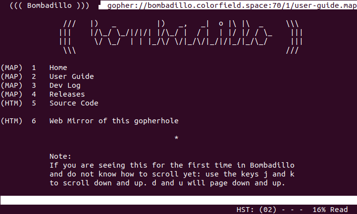

# Bombadillo - a non-web browser

Bombadillo is a non-web browser for the terminal.



Bombadillo features a full terminal user interface, vim-like keybindings, document pager, configurable settings, and a robust command selection.

Currently, Bombadillo supports the following protocols as first class citizens:
* gopher
* gemini
* finger
* local (a user's file system)

Support for the following protocols is also available via integration with 3rd party applications:
* telnet
    * Links are opened in a telnet application run as a subprocess.
* http/https
    * Web support is opt-in (turned off by default).
    * Links can be opened in a user's default web browser when in a graphical environment.
    * Web pages can be rendered directly in Bombadillo if [Lynx](https://lynx.invisible-island.net/) is installed on the system to handle the document parsing.

## Getting Started

These instructions will get a copy of the project up and running on your local machine. The following only applies if you are building from source (rather than using a precompiled binary).

### Prerequisites

You will need to have [Go](https://golang.org/) version >= 1.11.

### Building, Installing, Uninstalling

Bombadillo installation uses `make`. It is also possible to use Go to build and install (i.e `go build`, `go install`), but this is not the recommended approach.

Running `make` from the source code directory will build Bombadillo in the local directory. This is fine for testing or trying things out. For usage system-wide, and easy access to documentation, follow the installation instructions below. 

#### Basic Installation

Most users will want to install using the following commands:

```shell
git clone https://tildegit.org/sloum/bombadillo.git
cd bombadillo
sudo make install
```
*Note: the usage of `sudo` here will be system dependent. Most systems will require it for installation to `/usr/local/bin`.*

You can then start Bombadillo by running the command:
```shell
bombadillo
```
To familiarize yourself with the application, documentation is available by running the command:
```shell
man bombadillo
```

#### Custom Installation
##### Configuration Options
There are a number of default configuration options in the file `defaults.go`, allowing customisation of the default settings for users of Bombadillo.

To use this feature, amend the `defaults.go` file as appropriate, then follow the standard install instructions.

Full documentation for these options is contained within the `defaults.go` file.

An administrator might use this to feature to set a default for all users of a system. Typically though, these options should not need changing, and a user may change most of these settings themselves once they start Bombadillo. The one option that can only be configured in `defaults.go` is `configlocation` which controls where `.bombadillo.ini` is stored.

##### Override Install Location
The installation location can be overridden at compile time, which can be very useful for administrators wanting to set up Bombadillo on a multi-user machine. 

```shell
git clone https://tildegit.org/sloum/bombadillo.git
cd bombadillo
sudo make install PREFIX=/some/directory
```

There are two things to know about when using the above format:
1. The above would install Bombadillo to `/some/directory/bin`, _not_ to `/some/directory`. So you will want to make sure your `$PATH` is set accordingly.
2. Using the above will install the man page to `/some/directory/share/man/man1`, rather than its usual location. You will want to update your `manpath` accordingly.

There are other overrides available - please review the [Makefile](Makefile) for more information.

#### Uninstall

If you used the Makefile to install Bombadillo then uninstalling is very simple. From the Bombadillo source folder run:

```shell
sudo make uninstall
```

If you used a custom `PREFIX` value during install, you will need to supply it when uninstalling:

```shell
sudo make uninstall PREFIX=/some/directory
```

Uninstall will clean up any build files, remove the installed binary, and remove the man page from the system. If will _not_ remove any directories created as a part of the installation, nor will it remove any Bombadillo user configuration files.

#### Troubleshooting

If you run `bombadillo` and get `bombadillo: command not found`, try running `make` from within the cloned repo. Then try: `./bombadillo`. If that works it means  that the application is getting built correctly and the issue is likely in your path settings. Any errors during `make install` should be visible, and you will be able to see what command it failed on.

### Downloading

If you would prefer to download a binary for your system, rather than build from source, please visit the [Bombadillo releases](http://bombadillo.colorfield.space/releases) page. Don't see your OS/architecture? Bombadillo can be built for use with any system that is supported as a target for the Go compiler (Linux, BSD, OS X, Plan 9). There is no explicit support for, or testing done for, Windows or Plan 9. The program should build on those systems, but you may encounter unexpected behaviors or incompatibilities.

### Documentation

Bombadillo's primary documentation can be found in the man entry that installs with Bombadillo. To access it run `man bombadillo` after first installing Bombadillo. If for some reason that does not work, the document can be accessed directly from the source folder with `man ./bombadillo.1`.

In addition to the man page, users can get information on Bombadillo on the web @ [http://bombadillo.colorfield.space](http://bombadillo.colorfield.space). Running the command `help` inside Bombadillo will navigate a user to the gopher server hosted at [bombadillo.colorfield.space](gopher://bombadillo.colorfield.space); specifically the user guide.

## Contributing

Bombadillo development is largely handled by Sloum, with help from asdf, jboverf, and community input.

There are many ways to contribute to Bombadillo, including a fair few that don't require knowledge of programming:

- Try out the browser and let us know if you have a suggestion for improvement, or if you find a bug.
- Read the documentation and let us know if something isn't well explained, or needs correction.
- Maybe you have a cool logo or some art that you think would look nice.

If you have something in mind, please reach out or [open an issue](https://tildegit.org/sloum/bombadillo/issues).

We aim for simplicity and quality, and do our best to make Bombadillo useful to its users. Any proposals for change are reviewed by the maintainers with this in mind, and not every request will be accepted. Furthermore, this software is developed in our spare time for the good of all, and help is provided as best efforts. In general, we want to help!

The maintainers use the [tildegit](https://tildegit.org) issues system to discuss new features, track bugs, and communicate with users regarding issues and suggestions. Pull requests should typically have an associated issue, and should target the `develop` branch.

## Development

Following the standard install instructions should lead you to have nearly everything you need to commence development. The only additions to this are:

- To be able to submit pull requests, you will need to fork this repository first.
- The build process must be tested with Go 1.11 to ensure backward compatibility. This version can be installed as per the [Go install documentation](https://golang.org/doc/install#extra_versions). Check that changes build with this version using `make test`.
- Linting must be performed on new changes using `gofmt` and [golangci-lint](https://github.com/golangci/golangci-lint)

## License

This project is licensed under the GNU GPL version 3. See the [LICENSE](LICENSE) file for details.

## Releases

Starting with version 2.0.0 releases into `master` will be version-tagged. Work done toward the next release will be created on work branches named for what they are doing and then merged into `develop` to be combined with other ongoing efforts before a release is merged into `master`. At present there is no specific release schedule. It will depend on the urgency of the work that makes its way into develop and will be up to the project maintainers' judgement when to release from `develop`.
